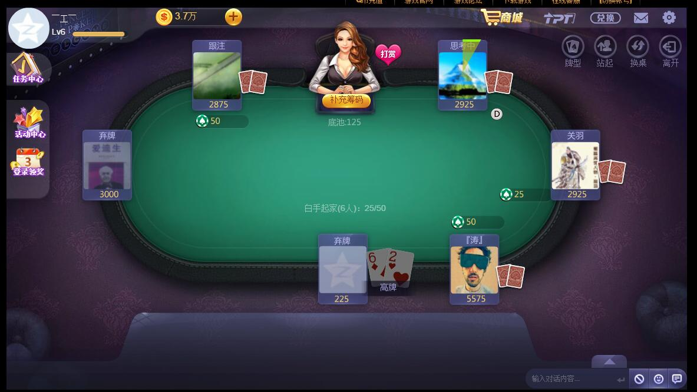
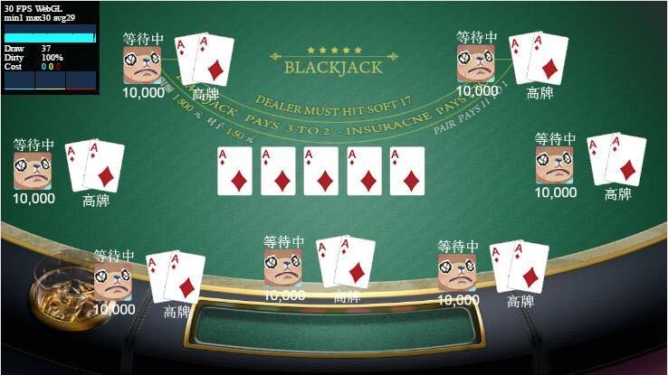

# Texas
No Comment, this project supposed to be make a Texas Holdem Game with HTML5, but i don't know how is my patience
  
## Develop Enviroment
* [Egret v4.1.0](https://github.com/egret-labs/egret-core)
* [Egret Wing 3.0](https://egret.com/products/wing.html)

  
## Things Needed To Figure out
* Backend:Golang or NodeJS, websocket is confirmed
* Database:Mongo decided, how is MySQL
* Something i forgot 
* token and session

## Looks Sucks Now

Target:  

  
Current:  
